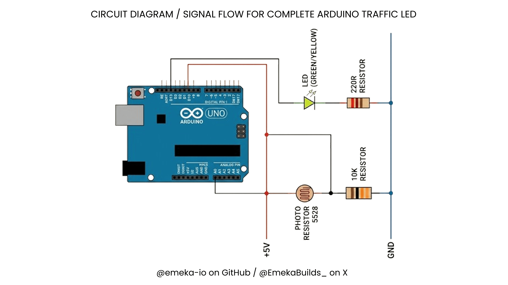
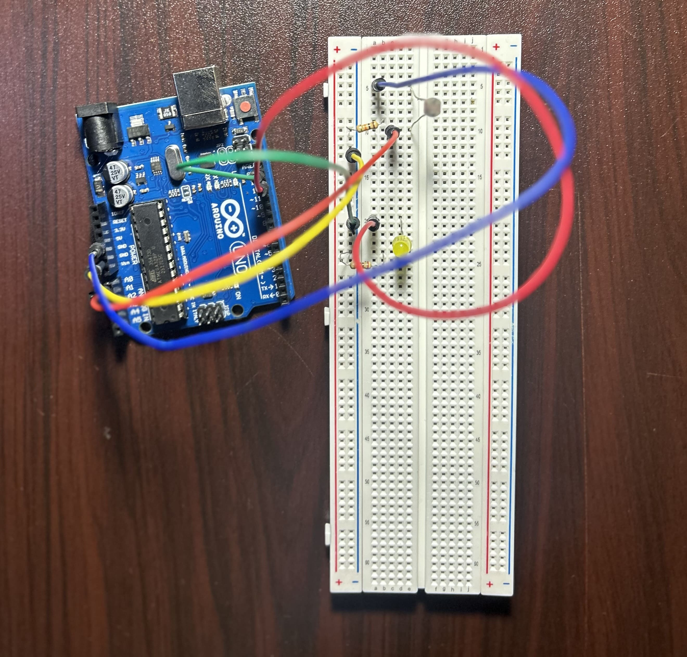

# Smart Night-Light System

An automated LED lighting system designed to optimize energy consumption by responding to environmental light conditions. This project is being built in three iterative phases.

## See it in Action
Check out the project demonstration and my build-in-public journey on X:
[Watch the Phase 1 Demo here](https://x.com/EmekaBuilds_/status/2043312047945891887?s=20)

---

## Project Phases
- [x] **Phase 1: The Core** - Autonomous light sensing and LED triggering.
- [ ] **Phase 2: User Control** - Manual override button and acoustic (Buzzer) feedback.
- [ ] **Phase 3: System Hardening** - Implementation of hysteresis logic for professional stability.

## Phase 1: The Core Logic
The current version uses a **Photoresistor (LDR)** and an **Arduino Uno** to create a "Sense-Think-Act" loop. The system automatically triggers the LED when ambient light drops below a specific threshold.

## Circuit Diagram

To ensure a clean signal flow, I mapped the voltage divider and LED output. This diagram serves as the blueprint for the Phase 1 build.

## Physical Build

A clear picture of my wiring.

### Components Used
* Arduino Uno
* Photoresistor (LDR 5528)
* 10K Ohm Resistor (Pull-down)
* 220 Ohm Resistor (LED Current Limiting)
* LED (Yellow/Green)
* Breadboard and Jumper Wires

### How it Works
The system uses a **Voltage Divider** circuit to convert the variable resistance of the LDR into a readable analog voltage (0-5V). The Arduino processes this via its Analog-to-Digital Converter (ADC), turning the LED `HIGH` when the environment is dark.

## Repository Structure
* `/src`: Contains the `.ino` source code for each phase.
* `/assets`: Wiring diagrams and project photos.
