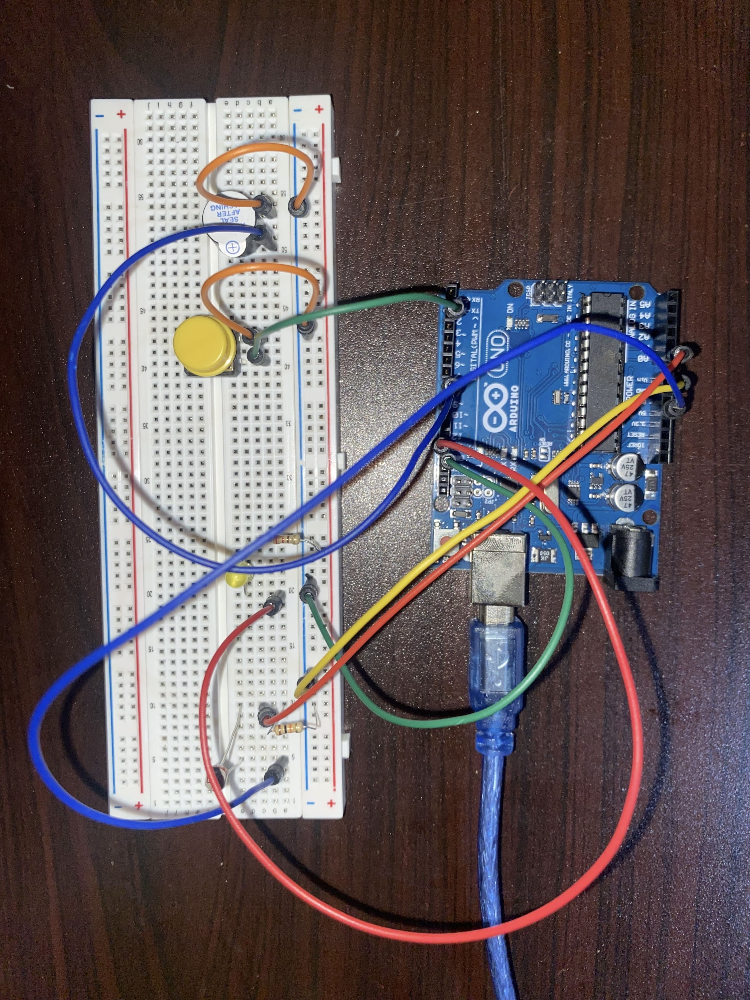

# Phase 2: Manual Control & Audible Feedback

## 1. Overview
Phase 2 is the **"User Empowerment"** stage of the Smart Light System. While Phase 1 proved the system could think, Phase 2 ensures the system obeys. This phase introduces a **Manual Override** and an **Active Buzzer** to move from a purely robotic response to a communicative, user-centric device.

## 2. The Problem
**The Autonomy Trap.** Phase 1 suffered from "Digital Tyranny"—the sensor had 100% control over the environment. 
1. **Lack of Agency:** The light would force itself on during movies or sleep if the room was dark. A system without a "manual off" switch is incomplete and intrusive.
2. **Lack of Feedback:** There was no audible confirmation. If the system was toggled or reached a state, it remained silent, making it difficult to know if the "brain" was actually registering user intent.

## 3. The Solution: Override Logic & System Alerts
I evolved the "Sense-Think-Act" loop into a **Sense-Interrupt-Act** loop. This gives the user the final "veto" power over the hardware while adding an audible layer of interaction.

### How it Works
1. **The Manual Override (Tactile Switch):** A momentary push-button was added to toggle the system's "Enabled" state. This allows the user to manually kill the light even if the LDR detects total darkness.
2. **Active Buzzer (Audible Confirmation):** To make the system feel "alive," an active buzzer provides a short 100ms beep whenever the button is pressed. This confirms the system has acknowledged the manual override command.

**The Logic Flow:**
- **Interrupt:** The Arduino monitors the digital pin for a state change from the button.
- **Toggle:** If pressed, it flips a boolean variable (`systemEnabled`).
- **Act:** The LED only turns on if (**It is Dark**) AND (**systemEnabled is True**).

## 4. Technical Specifications (BOM)
| Component | Specification | Role |
| :--- | :--- | :--- |
| **Tactile Push Button** | 4-pin Momentary | The "Veto" (Manual Override) |
| **Active Buzzer** | 5V DC | The "Voice" (Audible Feedback) |
| **10kΩ Resistor** | Fixed Resistor | Pull-down for Button stability |
| **LDR & LED** | (Retained from Phase 1) | Sensory Input & Light Output |

### System Architecture
Phase 2 integrates the button and buzzer circuitry into the existing LDR voltage divider setup:


*Figure 3: Schematic featuring the manual interrupt and buzzer alert.*


*Figure 4: Physical breadboard implementation of Phase 2 logic.*

## 5. Implementation & Code Snippet
The system now tracks a `systemEnabled` state. If this state is **false**, the LED remains off regardless of the light levels.

```cpp
// Phase 2 Logic: Manual Override & Active Buzzer
bool systemEnabled = true; // Tracks user preference
const int buttonPin = 2;
const int buzzerPin = 8;
const int ledPin = 13;
const int ldrPin = A0;

void setup() {
  pinMode(ledPin, OUTPUT);
  pinMode(buzzerPin, OUTPUT);
  pinMode(buttonPin, INPUT);
}

void loop() {
  int ldrValue = analogRead(ldrPin);
  
  // --- 1. SENSE INTERRUPT ---
  if (digitalRead(buttonPin) == HIGH) {
    systemEnabled = !systemEnabled; // Toggle state
    
    // Trigger audible feedback
    digitalWrite(buzzerPin, HIGH);
    delay(100);
    digitalWrite(buzzerPin, LOW);
    
    delay(300); // Debounce to prevent multiple triggers
  }

  // --- 2. CONDITIONAL ACT ---
  if (ldrValue < 450 && systemEnabled) {
    digitalWrite(ledPin, HIGH); // Act only if enabled AND dark
  } else {
    digitalWrite(ledPin, LOW);
  }
}
```

## 6. Observations & Limitations
Phase 2 successfully solved the **"Cinema Problem."** By adding the button, I regained personal agency over the hardware.

### Key Takeaways:
- **User Experience Matters:** Even a simple beep makes a device feel significantly more professional and responsive.
- **The "Twilight" Flickering:** While the manual control works, the light still "stutters" or flickers when the room brightness is exactly at the 450 threshold. This indicates a need for mathematical smoothing.

**Next Goal:** Implementing **Hysteresis (Dead Band Logic)** in Phase 3 to eliminate sensor jitter and stabilize the output.
